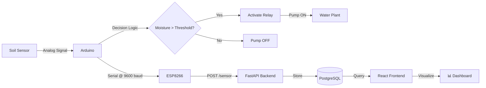

# 🌱 IoT Smart Irrigation System

> **A production-ready IoT solution combining embedded systems, real-time monitoring, and full-stack web technologies for automated plant care and environmental monitoring.**

---

## 📋 Overview

This project demonstrates a complete IoT ecosystem featuring:
- **Embedded Systems**: Arduino-based control logic with soil moisture sensing and automated pump relay management
- **IoT Connectivity**: ESP8266 wireless communication for real-time data transmission
- **Modern Web Stack**: FastAPI backend with React/Vite frontend for centralized monitoring
- **Real-time Dashboard**: Live sensor visualization with data persistence and historical analytics

Perfect for **agriculture automation, greenhouse monitoring, or smart home applications**.

---

## ⭐ Key Features

| Feature | Description |
|---------|-------------|
| 🌿 **Autonomous Control** | Automatic irrigation triggered by soil moisture thresholds without manual intervention |
| 📊 **Real-time Monitoring** | Live sensor data visualization through responsive web dashboard |
| 🔌 **Hybrid Architecture** | Dual-microcontroller system: Arduino for deterministic control, ESP8266 for wireless connectivity |
| 📱 **Remote Access** | Multi-platform monitoring via web dashboard and mobile notifications |
| 💾 **Data Persistence** | PostgreSQL/SQLite database for long-term analytics and trend analysis |
| 📈 **Historical Analytics** | Time-series data visualization with Recharts for pattern recognition |
| 🔐 **RESTful API** | Production-ready FastAPI with CORS support for scalable integrations |
| ⚙️ **Configurable Thresholds** | Adjustable soil moisture and watering parameters for different plant types |

---

## 🏗️ System Architecture

```
┌─────────────────────────────────────────────────────────────┐
│                    EMBEDDED LAYER                           │
├─────────────────────────────────────────────────────────────┤
│  Soil Moisture Sensor  →  Arduino UNO  →  Relay Module      │
│                              ↓                               │
│                          Serial (9600)                       │
│                              ↓                               │
│                         ESP8266 NodeMCU                      │
└─────────────────────────────────────────────────────────────┘
                               ↓
                          WiFi/MQTT
                               ↓
┌─────────────────────────────────────────────────────────────┐
│                  APPLICATION LAYER                          │
├─────────────────────────────────────────────────────────────┤
│  FastAPI Backend  →  PostgreSQL Database  ←  REST API       │
│       ↑                                          ↑            │
│       └──────────────── CORS ──────────────────┘            │
│                        ↓                                      │
│  React + Vite Frontend (Dashboard)                          │
│  • Real-time Sensor Visualization                           │
│  • Historical Data Analysis                                 │
│  • System Status Monitoring                                 │
└─────────────────────────────────────────────────────────────┘
```

---

## 🛠️ Technology Stack

### **Frontend**
- **Framework**: React 19.x with Vite
- **Styling**: Tailwind CSS v4
- **Data Visualization**: Recharts for time-series analytics
- **State Management**: React Hooks
- **Build Tool**: Vite (Lightning-fast HMR)

### **Backend**
- **Framework**: FastAPI (async Python)
- **Database**: SQLAlchemy ORM with SQLite/PostgreSQL
- **API**: RESTful endpoints with Pydantic validation
- **Middleware**: CORS support for cross-origin requests

### **Embedded Systems**
- **Microcontrollers**: Arduino UNO, ESP8266 (NodeMCU)
- **Sensors**: Analog soil moisture sensor
- **Actuators**: 5V relay module, water pump
- **Protocols**: Serial communication (9600 baud), WiFi

---

## 🧩 Hardware Components

| Component | Specification | Purpose |
|-----------|---------------|---------|
| Arduino UNO | ATmega328P | Deterministic irrigation control |
| ESP8266 | NodeMCU v3 | WiFi connectivity & cloud communication |
| Soil Moisture Sensor | Capacitive/Resistive | Real-time soil hydration monitoring |
| Relay Module | 1-Channel 5V | Pump activation switching |
| Water Pump | 5V-12V DC | Irrigation actuation |
| Voltage Divider | 1kΩ + 2kΩ resistors | 5V → 3.3V conversion (ESP8266 protection) |
| Power Supply | External adapter | System power distribution |

---

## 🔌 Hardware Wiring Diagram

### Soil Moisture Sensor → Arduino
```
VCC  → 5V
GND  → GND
AOUT → A0
```

### Relay Module → Arduino
```
IN  → D8 (PWM capable)
VCC → 5V
GND → GND
```

### Water Pump → Relay
```
COM        → Power Supply (+)
NO (N.O.)  → Pump (+)
GND        → Power Supply (-)
```

### Arduino ↔ ESP8266 (Serial, 9600 baud)
```
Arduino TX → 1kΩ resistor → ESP8266 RX
Arduino RX ← ESP8266 TX
GND ← (common ground) → GND
```

### ⚠️ Critical Safety Notes
- **Voltage Sensitivity**: ESP8266 operates at 3.3V; Arduino TX outputs 5V
- **Protection**: Voltage divider (1kΩ + 2kΩ) required to prevent ESP8266 damage
- **Ground Connection**: Common ground essential for all components
- **Power Isolation**: Never power pump directly from Arduino; use external power supply through relay

---

## 📂 Project Structure

```
IoT-Auto-Watering-System/
│
├── 📁 iotdashboard/
│   ├── 📁 backend/
│   │   ├── main.py              # FastAPI application & endpoints
│   │   ├── database.py          # SQLAlchemy configuration
│   │   ├── models.py            # Database schema (ORM models)
│   │   └── simulator.py         # Mock sensor data generator
│   │
│   └── 📁 frontend/
│       ├── src/
│       │   ├── App.jsx          # Main React component
│       │   ├── main.jsx         # Vite entry point
│       │   ├── 📁 components/
│       │   │   ├── MoistureCard.jsx      # Sensor display
│       │   │   ├── PumpCard.jsx          # Pump status
│       │   │   ├── 📁 charts/            # Data visualization
│       │   │   └── 📁 layout/            # Layout components
│       │   ├── 📁 services/
│       │   │   └── api.js       # API client (Axios/Fetch)
│       │   ├── 📁 hooks/
│       │   │   └── useSensorData.js      # Custom React hook
│       │   └── 📁 data/
│       │       └── mockData.js  # Dummy data for testing
│       │
│       ├── package.json         # Dependencies & scripts
│       ├── vite.config.js       # Vite configuration
│       └── tailwind.config.js   # Tailwind CSS setup
│
├── 📁 Mikrocontroller Code/
│   ├── Arduino_autowatering.cpp  # Arduino pump control logic
│   └── esp8266_monitoring.cpp    # ESP8266 WiFi communication
│
└── README.md
```

---

## 🚀 Getting Started

### Prerequisites
- **Node.js** 16+ & npm/pnpm
- **Python** 3.8+
- **Arduino IDE** 2.x
- **ESP8266 Board Support** installed in Arduino IDE

### Backend Setup

```bash
# 1. Navigate to backend directory
cd iotdashboard/backend

# 2. Create virtual environment
python -m venv venv
source venv/bin/activate  # On Windows: venv\Scripts\activate

# 3. Install dependencies
pip install fastapi uvicorn sqlalchemy pydantic

# 4. Run FastAPI server
uvicorn main:app --reload --host 0.0.0.0 --port 8000
```

**API will be available at**: `http://localhost:8000`  
**Swagger Docs**: `http://localhost:8000/docs`

### Frontend Setup

```bash
# 1. Navigate to frontend directory
cd iotdashboard/frontend

# 2. Install dependencies
npm install

# 3. Start development server
npm run dev

# 4. Build for production
npm run build
```

**Dashboard will be available at**: `http://localhost:5173`

### Embedded Systems Setup

#### Arduino Configuration
1. Open `Mikrocontroller Code/Arduino_autowatering.cpp` in Arduino IDE
2. Select **Board**: Arduino UNO
3. Select **Port**: COM (your Arduino port)
4. Configure threshold value (line ~15):
   ```cpp
   int dryThreshold = 600;  // Adjust based on your sensor calibration
   ```
5. Click **Upload**

#### ESP8266 Configuration
1. Open `Mikrocontroller Code/esp8266_monitoring.cpp` in Arduino IDE
2. Select **Board**: NodeMCU 1.0 (ESP-12E Module)
3. Configure WiFi credentials:
   ```cpp
   const char* ssid = "YOUR_SSID";
   const char* password = "YOUR_PASSWORD";
   ```
4. Update server endpoint:
   ```cpp
   String serverUrl = "http://YOUR_BACKEND_IP:8000/sensor";
   ```
5. Click **Upload**

---

## 📡 API Documentation

### Base URL
```
http://localhost:8000
```

### Endpoints

#### **GET** `/`
Health check endpoint

**Response**:
```json
{
  "message": "Database Connected"
}
```

---

#### **POST** `/sensor`
Receive sensor data from ESP8266

**Request Body**:
```json
{
  "moisture": 650
}
```

**Response**:
```json
{
  "message": "Data Saved Successfully",
  "id": 1,
  "timestamp": "2026-05-15T10:30:00"
}
```

---

#### **GET** `/sensor/latest`
Retrieve latest sensor reading

**Response**:
```json
{
  "id": 1,
  "moisture": 650,
  "timestamp": "2026-05-15T10:30:00"
}
```

---

#### **GET** `/sensor/history?limit=100`
Fetch historical sensor data

**Query Parameters**:
- `limit` (int): Maximum records to return (default: 100)
- `offset` (int): Pagination offset (default: 0)

**Response**:
```json
[
  {
    "id": 1,
    "moisture": 650,
    "timestamp": "2026-05-15T10:30:00"
  }
]
```

---

## 📊 Data Flow



---

## 🎯 Use Cases

- **Smart Gardens**: Autonomous irrigation for residential gardens
- **Greenhouse Automation**: Large-scale environmental monitoring
- **Research Projects**: IoT platform for agricultural studies
- **Educational**: Full-stack IoT application for learning embedded systems + web development
- **Home Automation**: Integration with smart home ecosystems

---

## 📈 Future Enhancements

- [ ] **Machine Learning**: Predictive watering based on weather data
- [ ] **Mobile App**: React Native cross-platform application
- [ ] **Multiple Zones**: Support for multiple gardens/sensors
- [ ] **MQTT Protocol**: Replace HTTP with MQTT for lower latency
- [ ] **Cloud Integration**: AWS/Azure IoT Hub deployment
- [ ] **Alert System**: Email/SMS notifications for critical thresholds
- [ ] **User Authentication**: Secure multi-user dashboard
- [ ] **Data Export**: CSV/JSON export for analysis
- [ ] **Energy Analytics**: Power consumption tracking

---

## 🤝 Contributing

Contributions are welcome! Please follow these steps:

1. **Fork** the repository
2. **Create** a feature branch (`git checkout -b feature/amazing-feature`)
3. **Commit** your changes (`git commit -m 'Add amazing feature'`)
4. **Push** to branch (`git push origin feature/amazing-feature`)
5. **Open** a Pull Request

---

## 📝 License

This project is licensed under the **MIT License** - see the LICENSE file for details.

---

## 👨‍💻 About

This project showcases expertise in:
- ✅ Full-stack web development (React + Python)
- ✅ IoT system design and embedded programming
- ✅ Database modeling and API design
- ✅ Hardware integration and protocol implementation
- ✅ Real-time data visualization
- ✅ DevOps and system architecture

**Perfect for portfolios and demonstrating hardware-software integration skills.**

---

## 📞 Support

For questions or issues:
- 📧 Email: [sofiantjkt@gmail.com]
- 🐛 GitHub Issues: [Create an issue](../../issues)
- 💬 Discussions: [Join discussions](../../discussions)

---

<div align="center">

**Built with ❤️ for IoT enthusiasts and developers**

[⭐ Star this repo](#) if you found it helpful!

</div>
    digitalWrite(RELAY_PIN, HIGH); // Pump OFF
  }

  Serial.println(moistureValue);
  delay(2000);
}
```

---

# 📡 ESP8266 Code (Blynk Monitoring)

```cpp
#define BLYNK_TEMPLATE_ID "YOUR_TEMPLATE_ID"
#define BLYNK_DEVICE_NAME "AutoWateringMonitor"
#define BLYNK_AUTH_TOKEN "YOUR_AUTH_TOKEN"

#include <ESP8266WiFi.h>
#include <BlynkSimpleEsp8266.h>

char ssid[] = "YOUR_WIFI_NAME";
char pass[] = "YOUR_WIFI_PASSWORD";

int moistureValue = 0;
BlynkTimer timer;

void sendToBlynk() {
  Blynk.virtualWrite(V0, moistureValue);

  if (moistureValue > 600) {
    Blynk.virtualWrite(V1, 1);
  } else {
    Blynk.virtualWrite(V1, 0);
  }
}

void setup() {
  Serial.begin(9600);
  Blynk.begin(BLYNK_AUTH_TOKEN, ssid, pass);
  timer.setInterval(2000L, sendToBlynk);
}

void loop() {
  Blynk.run();
  timer.run();

  if (Serial.available()) {
    moistureValue = Serial.parseInt();
  }
}
```

---

# 📱 Blynk Setup

## Create Template

* Hardware: ESP8266
* Connection: WiFi

## Datastreams

* V0 → Moisture (0–1023)
* V1 → Pump Status (0/1)

## Widgets

* Gauge → V0
* LED → V1

---

# 🔄 How It Works

1. Soil moisture sensor reads soil condition
2. Arduino processes the value
3. If soil is dry → pump turns ON
4. If soil is wet → pump turns OFF
5. Arduino sends data via Serial
6. ESP8266 receives and sends to Blynk
7. User monitors data in real-time

---

# 🧪 Calibration

* Dry soil → note value (e.g., 700–800)
* Wet soil → note value (e.g., 300–400)

Adjust:

```cpp
int dryThreshold = 600;
```

---

# 🚀 Future Improvements

* Replace relay with MOSFET (more efficient)
* Add water level sensor
* Add notification alerts in Blynk
* Use only ESP8266 (remove Arduino)
* Add data logging & analytics

---

# 📌 Project Status

✅ Working
🔧 Expandable
📡 IoT-enabled

---

# 👨‍💻 Author

Developed as a learning + practical IoT project combining:

* Embedded systems
* Automation
* IoT monitoring

---

# 📜 License

Free to use for educational and personal projects.
